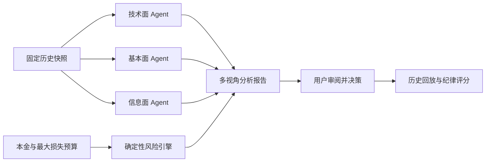
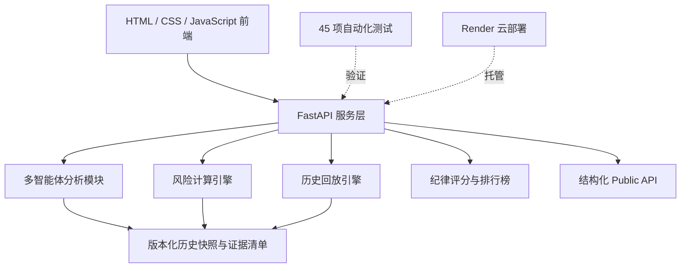
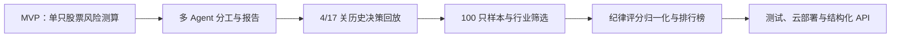

# RiskPilot · AI 风险决策训练产品

> 用多智能体分析、确定性风险规则和历史回放，帮助投资新手先理解“最多能承受多少损失”，再讨论仓位与决策。

[在线体验](https://five609-riskpilot-aix-origin-2026.onrender.com/) · [历史决策实验](https://five609-riskpilot-aix-origin-2026.onrender.com/replay) · [系统架构](./RiskPilot_系统架构图.html) · [本地运行](#本地运行)

> 免费云服务可能休眠，首次打开通常需要等待几十秒。本产品使用固定历史数据，不连接真实证券账户、不自动下单，不构成投资建议或收益承诺。

## 30 秒了解项目

| 招聘方关心的问题 | RiskPilot 的回答 |
|---|---|
| **它是什么？** | 一款可在线运行的 AI 风险教育与历史决策实验产品，而不是“预测明天涨跌”的荐股工具。 |
| **为谁服务？** | 缺少仓位意识、容易被单一观点影响、难以量化风险承受能力的投资新手。 |
| **解决什么问题？** | 把模糊的“我能承受亏损”转化为损失预算、参考仓位、压力情景和可复盘的决策纪律。 |
| **AI 做什么？** | 技术面、基本面和信息面 Agent 分工研究并解释依据；AI 不直接决定仓位，也不能覆盖风险规则。 |
| **人做什么？** | 用户设定本金与损失边界、审阅不同观点并作最终选择；产品团队定义规则、校验数据、设计交互并持续测试。 |
| **做到什么程度？** | 已完成 100 只历史样本、4/17 关回放、纪律评分、排行榜、标准化 API、45 项自动化测试和云端部署。 |

## 人在其中承担什么

RiskPilot 采用 Human-in-the-loop 设计。Agent 负责整理和解释信息，但风险边界与最终决策始终由人掌握：

1. **用户先定义边界**：输入模拟本金和最大可承受损失，而不是先问“买哪只”。
2. **系统提供多视角证据**：三个 Agent 分别分析价格行为、公司基本面和公开信息。
3. **规则引擎独立约束**：根据波动与止损情景计算参考仓位，AI 文案不能修改计算结果。
4. **用户作最终选择**：可以接受或突破建议，但系统记录预算突破、情绪化调整与结果。
5. **复盘而非替代判断**：历史实验展示账户轨迹、最大回撤和纪律评分，帮助用户识别决策模式。

## Agent 怎么工作



设计原则：

- Agent 只读取当前历史节点能够看到的数据，避免未来信息泄漏。
- 无 API Key 时使用明确标识的离线预设分析，不伪装成实时大模型调用。
- 真实 LLM 模式仅从环境变量读取密钥，并保留模型、响应和报告哈希等运行证据。
- Agent 输出负责解释，风险引擎负责计算；两者职责分离，便于核验和追责。

## 产品架构



- `frontend/`：股票分析与历史实验页面。
- `backend/`：API、多智能体分析、风险计算、历史回放与排行榜逻辑。
- `data/`：固定股票池、历史行情及可追溯证据文件。
- `tests/`：风险引擎、历史回放、数据隔离和接口测试。

## Demo 截图

> 真实界面截图将放置在 `docs/assets/`。当前可直接打开以下在线 Demo 查看完整交互。

- [股票风险体检](https://five609-riskpilot-aix-origin-2026.onrender.com/)
- [时间穿越挑战](https://five609-riskpilot-aix-origin-2026.onrender.com/replay)

建议体验路径：输入本金和最大损失预算 → 载入快速体验案例 → 查看三个 Agent 分析与风险结果 → 进入历史挑战 → 完成 4 关决策 → 查看纪律评分和排行榜。

## 技术栈

| 层级 | 技术与职责 |
|---|---|
| 产品前端 | HTML5、CSS3、原生 JavaScript，负责响应式页面、K 线、交互实验和结果反馈 |
| 服务端 | Python、FastAPI、Uvicorn，负责接口编排、参数校验和静态页面托管 |
| Agent 层 | OpenAI 兼容 SDK、结构化提示词、离线降级机制，支持 OpenAI/DeepSeek 可选接入 |
| 风险与回放 | Python 确定性规则、时间节点隔离、账户状态机、压力情景与纪律评分 |
| 数据与可追溯 | JSON/CSV、原始响应、来源清单、SHA-256 校验 |
| 质量保障 | `unittest` 自动化测试，覆盖时间隔离、预算规则、执行逻辑、排行榜和 API |
| 部署 | GitHub + Render，持续部署公开在线版本 |

## 产品迭代



关键迭代不是简单增加页面，而是持续解决产品可信度问题：

- 从“给观点”转向“先定义损失预算”。
- 从单一 AI 结论转向多 Agent 分工与规则引擎交叉约束。
- 从一次性报告扩展为连续决策、账户轨迹和行为复盘。
- 从少量固定样本扩展到 100 只历史样本，同时公开说明抽样偏差和数据边界。
- 将 4 关与 17 关的评分按决策次数归一化，避免实验长度造成评价失真。
- 把排行榜成绩改为服务端重放计算，降低前端伪造结果的可能。
- 增加自动化测试与云部署，使项目从演示原型升级为可访问、可验证的产品作品。

## 项目协作与我的贡献

项目采用两人共同负责的协作方式，产品讨论、功能取舍、测试验收和版本迭代大多共同完成，不将成果机械拆分为互不关联的个人模块。

我的主要投入体现在：

- **产品定义**：明确目标用户、风险预算优先的核心价值和“分析 + 历史实验”双路径。
- **Agent 产品设计**：划分多 Agent 职责，建立 AI 解释与确定性风险规则相互约束的工作流。
- **需求与交互**：设计本金/损失预算、仓位建议、时间穿越、纪律评分和结果反馈等关键机制。
- **数据与验证**：推动样本扩展、时间隔离、结果复算、异常路径和无 Key 降级测试。
- **工程协同**：借助 AI 编程工具完成需求到代码的快速迭代，并对生成结果进行人工核验和回归测试。
- **产品化交付**：完成在线部署、公开 API、文档整理、安全检查和面向外部用户的作品集包装。

这段经历重点体现的不是“独立写了多少行代码”，而是把用户问题转化为产品规则，组织 Agent、数据、交互和工程验证，最终交付一个可运行、可解释、可复盘的 AI 产品。

## 本地运行

1. 安装 Python 3.11 或更高版本，并勾选 `Add Python to PATH`。
2. 下载或克隆本仓库。
3. 双击 `运行演示.cmd`，首次启动需要联网安装依赖。
4. 打开 `http://127.0.0.1:8012/`；历史实验地址为 `http://127.0.0.1:8012/replay`。

也可以手动启动：

```powershell
python -m pip install -r backend/requirements.txt
python backend/main.py
```

## 测试

```powershell
python -m unittest discover -s tests -v
```

测试覆盖风险预算、回放时间隔离、执行规则、数据完整性、排行榜服务端复算和结构化 API。当前公开版本全量 45 项测试通过。

## 数据、AI 与合规边界

- 默认无需 API Key，使用可离线运行的预设分析；这不代表每次执行都发生了真实 LLM 推理。
- 真实 LLM 模式仅从环境变量读取密钥，仓库不保存任何密钥。
- 历史实验仅使用节点及以前的数据，不查看尚未揭晓的未来走势。
- 当前样本是产品验证数据集，不是随机或市值加权抽样，也不是股票推荐池。
- 上游公开可访问不等于获得商业再分发授权；商业化前需重新核验数据许可与合规要求。

本仓库用于个人作品展示与技术交流，暂未授予复制、修改、再发布或商业使用许可。第三方数据及文档的权利归各自权利人所有。